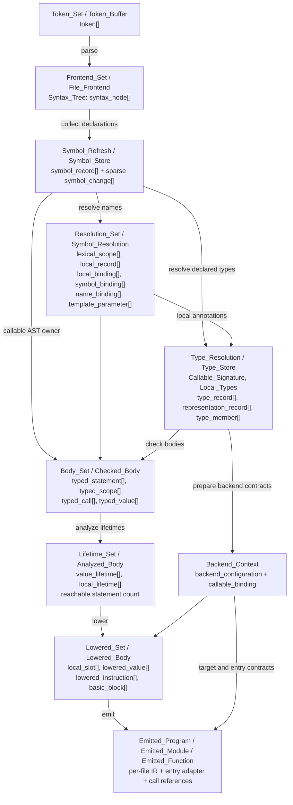
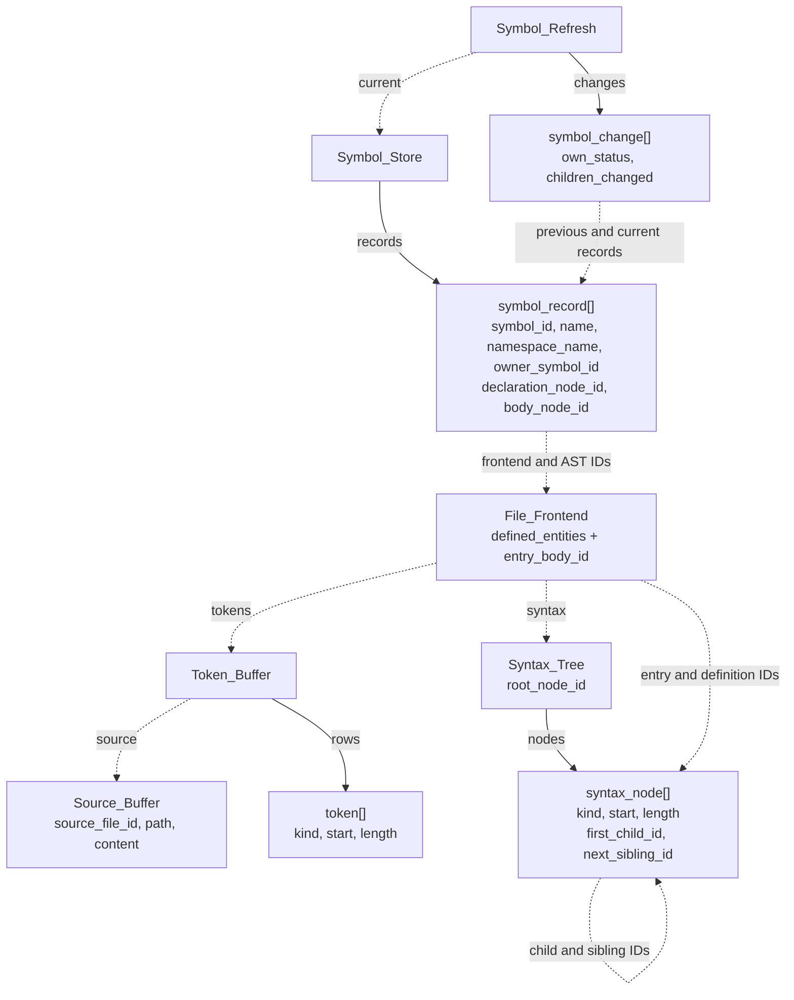
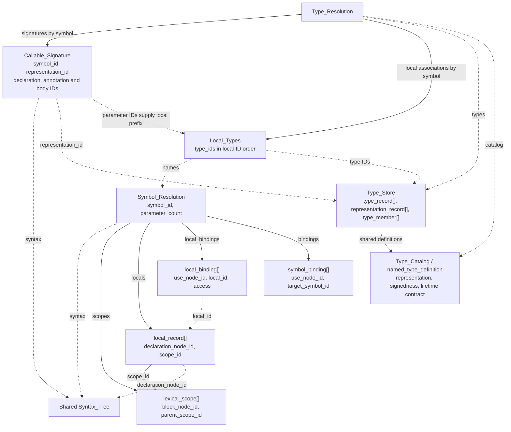
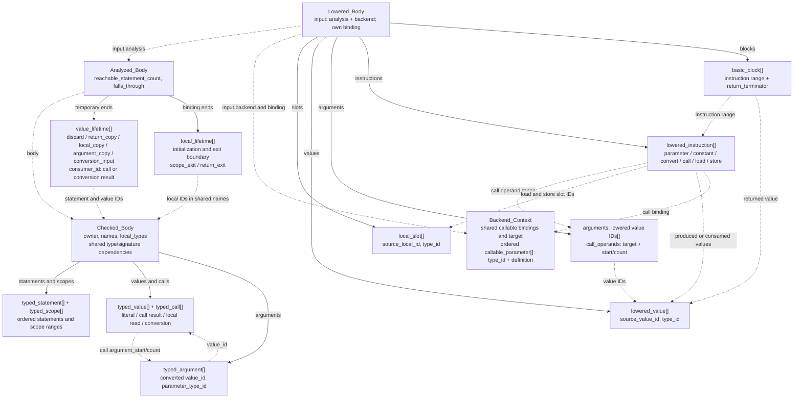
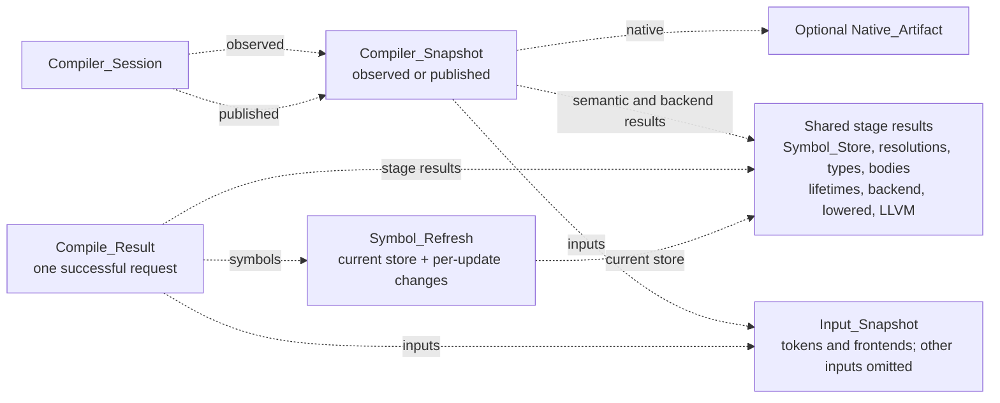

# Core data structures
Doc Status: supporting

Checked against the PHP prototype on 2026-09-11. These diagrams describe current
records and references, not the future full language. Manifest/discovery details,
native artifact packaging and temporary worker records are omitted.

Lowercase names are PHP record classes intended for inline structs in the eventual
Simple C++ port. `[]` denotes a dataset; records do not each contain that dataset.

**Current boundary:** initialized scalar locals, scopes, typed parameters and
positional calls compile through LLVM to native code. Parameter names occupy the
root-scope local prefix; their shared signature types supply its local-type IDs.
Lifetimes authorize entry initialization and argument copies; lowering prepares
local storage and ordered call operands. Identity and same-family, same-signed integer widening support copyable,
no-cleanup scalars. See the [foundations tracker](../planning/compiler_foundations.md).

## Data through the stages

Here arrows mean input dependencies, not ownership or copies. Boxes group stage
results with their main records. The coordinator schedules these stages; they
do not invoke each other recursively.

Shared language definitions feed type resolution, conversions and lifetime
contracts. Target/toolchain facts feed backend preparation. Syntax comparison
produces the sparse change catalog; the incremental gate decides whether work
can be selected narrowly or requires `full_rebuild` through the same stages.

## Frontend and project symbols

In all remaining diagrams, solid arrows mean a container holds records or a
component. Dotted arrows mean references to shared objects or records through IDs.
Neither arrow promises a deep copy or exclusive ownership in PHP.

Each file has one root whose children are its implicit entry block and top-level
function declarations. The entry body is an ordinary block. A symbol references
its declaration/body in that exact file AST; it never copies a body.

- Function children: name, parameter list, return-type name, body block.
- Parameter-list children: ordered parameter declarations, each with a variable
  name and type name. They remain under their function, outside project symbols.
- Call children: target name, then ordered argument expressions. Nested calls use
  the same nodes and sibling links; no separate argument dataset is retained.

The change catalog references previous/current symbols. Wholly unchanged pairs
are omitted after comparison; removals retain only their previous origin.
Parameter-list edits affect the function definition; argument edits affect its body.

## Callable bindings and shared types

Parameters occupy the first `parameter_count` rows of `locals`, in source order,
all in root scope. Their one-based position is also their local ID.
`parameter_for(position)` returns the same record as `local_for(id)`. Body locals
follow them; all uses share `binding_for(node_id)` and the same lexical lookup.
The AST distinguishes parameter declarations from body-local declarations.

Types have separate semantic IDs and representation IDs. Different semantic types
can share a representation; signedness and copying/cleanup facts remain in the
shared definition. `Local_Types` associates IDs without copying declarations or
definitions. Currently the type pipeline produces these associations only for
body locals and declared parameters. Parameter types occupy the signature member
range and supply the matching prefix of `Local_Types.type_ids`; definitions and
AST nodes are shared. Compound representation/member storage
exists, but does not establish executable aggregate support.

## Checked values, lifetimes and lowered storage

A local read produces a new typed value referencing its source local ID; it is
not the local's storage. Statements identify their value, call range, scope,
write destination. Conversion values retain an earlier input value ID and the
resolved operation; identity needs no additional node. `conversion_for(value_id)`
exposes this unary plan. Void calls have no value row.
Call argument ranges preserve left-to-right evaluation, including nested calls;
`argument_for(call_id, position)` returns the shared argument record.
`entry_parameter_count()` identifies initialized incoming local IDs 1..count,
without fabricated assignment statements. Their binding lifetime uses
`initialized_statement_id = 0`. Argument temporaries end with `argument_copy`
and their `consumer_id`, after later arguments have been evaluated.
Lowering consumes these facts at entry and at each call. Incoming lowered values
have source value ID zero; parameter instructions carry their incoming ordinal.
Calls retain shared targets and ranges of already produced lowered value IDs.
A `conversion_input` lifetime ends at its produced value ID. Lowering emits a
`convert` instruction with input value ID and selected backend primitive.
Lifetime analysis retains the checked body and adds facts only for reached work,
with one binding lifetime per reached declaration, not per assignment.

Lowering gives each reached local, including each parameter, one slot. Loads produce values; initialization
and assignment share stores with slot/value operands and no result. Unreachable
locals produce no slots. Blocks select instruction ranges and carry separate
return terminators; the current straight-line subset uses one block per callable.
`signature_for(symbol_id)` and `definition_for(type_id)` expose shared contracts.
LLVM emission consumes these plans, emitting entry-block allocations, loads,
stores, calls and returns. Each `Emitted_Function` retains its `Lowered_Body`;
the function join groups these shared rows in a temporary `Emitted_Function_Set`.
File selection creates `module_task` records only for selected files, referencing
their functions, fixed backend and optional entry plan. Independent assembly
workers produce `Emitted_Module` results; the module join retains unselected
modules and returns the completed `Emitted_Program` to its caller. The temporary
groups/tasks are not retained in the program. `Emitted_Program` indexes functions
and file modules. Each `Emitted_Module`
contains its source definitions and distinct external call declarations; the
manifest entry module adds the native adapter. `Native_Artifact` shares one
`Native_Object` file owner per current module. A body edit replaces its file
module/object; old readers keep their previous object files alive.
The artifact also retains the toolchain's `link_configuration` (resolved linker
executable and identity key), separate from object-generation configuration.
Changing it relinks shared objects without replacing semantic/LLVM results.

## Retained snapshots and updates

The two session references may point to different snapshots. Snapshots hold the
current `Symbol_Store`; the returned `Compile_Result` holds the change catalog.
Inspection adopts `observed` only after all stages through LLVM succeed. Native
publication prepares both snapshots before publishing the executable and adopts
them afterward. Failed requests preserve both references. Comparisons use
`published` when present, otherwise `observed`.

Workers read fixed inputs and return private results; coordinator joins validate
and adopt complete batches. Execution remains serial. Unchanged results share
records when their dependencies remain valid. Replacing a file AST currently
refreshes semantic work for its functions. Full rebuild selects all current work
through the same stages; removed contributions are excluded independently.
See [incremental rules](incremental_refresh_rules.md).

## Identity and code references

IDs are one-based within their owning dataset; zero is absent/no value where
allowed. Contiguous ranges use zero-based start plus count. Identical numbers
across datasets or replaced snapshots do not establish identical objects.

| Owner / identity | Prototype definition |
|---|---|
| File AST: node IDs within one file snapshot | [syntax records](../../src/03_parse/data/structures.php), [role access](../../src/03_parse/utilities/syntax_access.php) |
| Project symbols: logical symbol IDs, matched across updates | [symbol records](../../src/04_analyze/collect_symbols/data/structures.php), [store](../../src/04_analyze/collect_symbols/data/store.php) |
| Callable scope/local IDs: one exact name-resolution result | [binding records](../../src/04_analyze/resolve_symbols/data/structures.php), [result and accessors](../../src/04_analyze/resolve_symbols/data/result.php) |
| Type/representation IDs: one type-store lineage | [type records](../../src/04_analyze/type_model/data/representations.php), [type associations](../../src/04_analyze/resolve_types/data/result.php) |
| Checked value/call IDs and statement/scope ranges | [body records](../../src/04_analyze/check_bodies/data/structures.php), [shared dependencies](../../src/04_analyze/check_bodies/data/result.php) |
| Temporary and local lifetime facts | [lifetime records](../../src/04_analyze/analyze_lifetimes/data/structures.php), [analyzed body](../../src/04_analyze/analyze_lifetimes/data/result.php) |
| Lowered slot/value/block IDs and instruction ranges | [lowered records](../../src/05_generate_code/lower/data/structures.php), [lowered body](../../src/05_generate_code/lower/data/result.php), [backend context](../../src/05_generate_code/prepare_backend/data/context.php) |
| Emitted functions: project symbol lookup | [LLVM results](../../src/05_generate_code/emit_llvm/data/result.php) |
| Retained session snapshots | [session and snapshots](../../src/compile/compile.php) |
