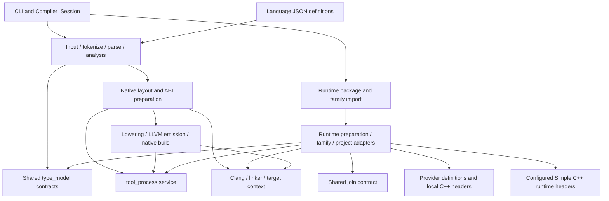

# Migration boundary and dependencies
Doc Status: planning

## Preservation inventory

Counts are tracked files at the pinned revision, not counts of production classes.
The [machine inventory](source_inventory.json) provides every path and fingerprint.

| Source area | Tracked files | PHP files | Disposition / proposed destination |
| --- | ---: | ---: | --- |
| `prototype/src/` | 289 | 264 | Adopt all stages, including 61 files under code generation and 8 under build output, into `compiler/src/` |
| `prototype/src-runtime-preparation/` | 71 | 36 | Adopt preparation, definitions, native headers, family/project bridges and 26 test/support files into `compiler/src-runtime-preparation/` |
| `prototype/tool_process/` | 2 | 1 | Adopt shared process service into `compiler/tool_process/` |
| `prototype/bootstrap.php` | 1 | 1 | Adopt PHP composition root into `compiler/bootstrap.php`; loading strategy can change in the portability phase |
| `prototype/language/` | 3 | 0 | Adopt definitions and explanation into `compiler/language/` |
| `prototype/tests/` | 125 | 116 | Adopt full compiler proof suite into `compiler/tests/` |
| `prototype/benchmarks/` | 34 | 5 | Preserve runners, reports and data in `compiler/benchmarks/`; correctness baseline does not require every performance replay |
| Root `docs/` plus `prototype/docs/` | 89 | 0 | Preserve architecture, semantics, detailed proofs and tracker under `compiler/docs/`; proposed paths have no collisions |
| Root `examples/` | 2,295 | 0 | Preserve under `compiler/examples/`; 2,284 are scalability fixtures, 11 are other examples/support files |
| `tools/backend.json`, `tools/toolchain.json` | 2 | 0 | Preserve configuration intent under `compiler/tools/`; explicit relocation and toolchain-equivalence checks |
| Root historical `src/`, `tests/`, remaining `tools/*.py` | 51 | 0 | Preserve original PHP++ implementation and tooling under `compiler/reference/original-phpp/`, not a second active implementation |
| Prototype README | 1 | 0 | Merge/adopt into compiler entry guide with source provenance; existing skeleton is not authority over the adopted implementation |
| Repository policy, IDE metadata and generated-directory ignore policy | 5 | 0 | Preserve policies/IDE metadata as reference; retain ignore policy for derived runtime output |

Total: 2,968 tracked files, 24,181,166 bytes. Production and supporting roles must
not be conflated: the 36 preparation PHP files include its PHP tests.
Ignored build outputs, caches, locks and generated provider artifacts are not the
maintained source. Preserve any specifically needed historical evidence deliberately;
rebuild packages for the recorded toolchain instead of trusting old cached output.

## Full portability boundary

**Executable production PHP to migrate:** compiler/session/CLI code, runtime
preparation including family/project adapters, and the shared process service.
Keep all native backend code even though v0.2's later delivery goal is C++ generation.

**Adopt, but do not mechanically convert as PHP program code:** JSON definitions,
provider C++ headers, documentation, test inputs, shell/Python drivers, benchmark
reports and historical PHP++ sources. Their paths/contracts still need relocation
checks. PHP test harnesses may remain PHP drivers initially; native witnesses must
exercise the converted production components with equivalent assertions. Tests
requiring PHP internals/reflection or direct PHP object inspection need explicit
native witnesses rather than blind conversion or silent removal.

**Composition roots:** bootstrap/include wiring is infrastructure. Preserve its
current PHP execution first. During portability, separate PHP loading from generated
PHP++ project membership; do not force `require_once` into the converter.

No retained test may disappear merely because the current converter cannot express
its harness. Record how its assertion is represented or why it is host-specific.

## Dependency map

Evidence anchors in the source checkout:

- `prototype/bootstrap.php` composes compiler stages, shared records and process IO.
- `prototype/src-runtime-preparation/bootstrap.php` loads `tool_process`, shared
  type references/calls/lifecycles/families and `src/compile/join.php`.
- `prototype/tests/support/{source_family_support,source_export_support,managed_storage_support}.php`
  load preparation and exercise compiler/provider integration.
- `prototype/src/05_generate_code/prepare_backend/tools/toolchain.php` locates
  root `tools/backend.json` through its current relative layout.
- `prototype/tests/run.py` locates root examples separately from prototype source.

Runtime preparation is consequently in the adoption boundary now, even if its
portability work occurs later in dependency order. Splitting it into a future
independent copy would duplicate shared contracts and risk divergence.

## Relocation and preservation work

1. Capture source revision, clean-state evidence and the complete inventory. Preserve
   source history through a verified archive/bundle or equivalent provenance step
   before treating the original as retired. The [adoption checkpoint](adoption.md)
   now records the verified history bundle and complete source adoption.
2. Adopt the whole tracked boundary before algorithm adaptation; use the inventory's
   proposed destinations, checking for collisions with existing skeleton files.
3. Fix only relative path/config/document-link changes required by relocation.
   In particular test ROOT calculations, backend config paths, provider include
   paths, examples and bootstrap roots. Keep an explicit relocation diff.
4. Retain original working rules as reference, then reconcile applicable compiler
   guidance with this repository's authority map. Do not install an old AGENTS.md
   that silently changes repository authority or starts parallel development.
5. Reproduce the baseline, then make this the sole writable compiler implementation.
   Adapt portable PHP incrementally here; generated PHP++ is derived output.

The original repository's `src/` is historical PHP++ already, not the destination
for a second port. Preserve it for reference, not as a competing source of truth.

## Early migration risks, not implementation assignments

A textual scan of production/preparation trees found candidate trait syntax in 44
PHP files, clone usage in 10, arrow functions in 48, array text in 240 and mixed text
in 21. Counts include textual/documentary occurrences and preparation tests; they
are not a semantic census. Exact candidate files are recorded in the inventory.

Traits are especially relevant: existing prototype organization uses private handler
traits, while the current PHP++ target rejects general traits. Decide how to preserve
that organization with an equivalent portable representation; do not introduce a
cross-file semantic resolver into the converter. PHP arrays used as records and
retained snapshot clone behavior also require explicit value/aliasing decisions.

The single process service uses native process facilities. Its PHP implementation
and eventual PHP++ implementation need the same IO, timeout, exit and cancellation
contract; a function-name rewrite alone does not establish parity.

Full migration precedes new functionality. A missing target feature is a migration
blocker to discuss, not permission to implement a new compiler feature silently.
